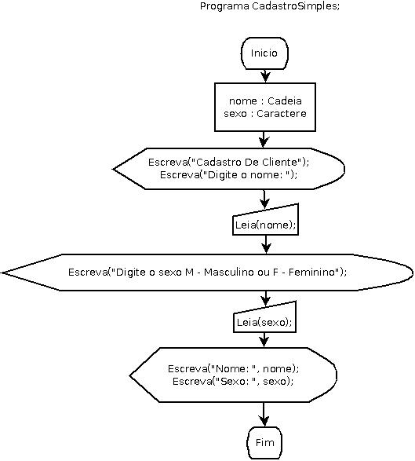

# CadastroSimplesEmDiagramadeBlocos

**Cadastro Simples Em Diagrama de Blocos - Fluxograma**

## Enunciado

**Desenvolver um programa que faça a entrada do nome de uma pessoa e de seu sexo, em seguida deve apresentar os dados anteriores informados.**

   

Autor: Erick Leite Freire 
Criado em: 23-11-2023 
Site: [Escola do Autodidata](https://www.escoladoautodidata.com.br) 
